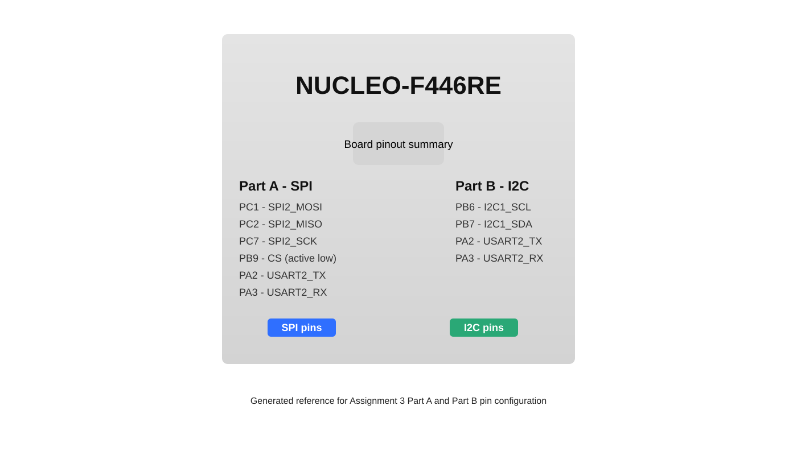

# Assignment 3

This folder contains the bare-metal BMP280 sensor projects for Assignment 3 on the NUCLEO-F446RE.

## Board Pinout Reference

The reference image is stored in the repo at `Assignment 3/assets/nucleo-f446re-pinout.svg`.

## Part A - BMP280 over SPI

Part A uses the BMP280 in SPI mode.

### BMP280 Module Wiring

| BMP280 pin | Connection |
| --- | --- |
| VCC | 3.3V |
| GND | GND |
| SCL | D9 |
| SDA | A4 |
| CS | D14 |
| SDO | A4 |

## Part B - BMP280 over I2C

Part B uses the BMP280 in I2C mode.

### BMP280 Module Wiring

| BMP280 pin | Connection |
| --- | --- |
| VCC | 3.3V |
| GND | GND |
| SCL | PB6 (D10) |
| SDA | PB7 (CN7-21) |
| CSB | 3.3V |
| SDO | GND for I2C |

## Project Map

- [Part A BareMetal](PartA_BareMetal)
- [Part B BareMetal](PartB_BareMetal)
